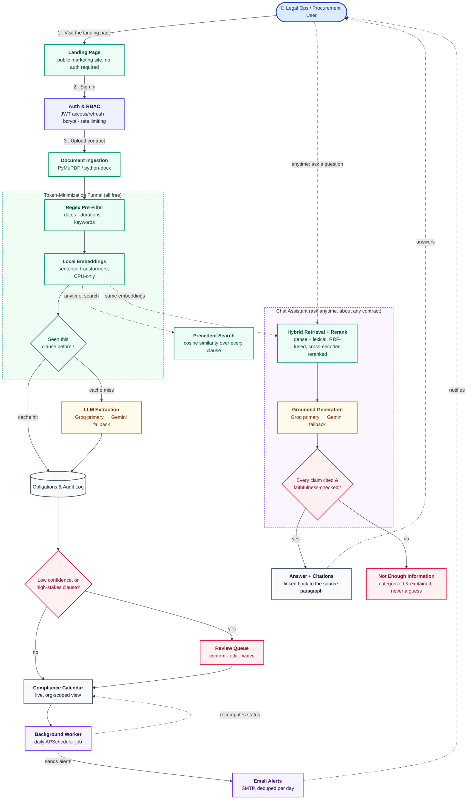

# ObliTrack

**Contract Lifecycle & Obligation Management for legal and procurement teams.**

## Overview

Every contract a company signs comes with a set of promises baked into its
fine print — a renewal that auto-triggers unless someone objects in time, a
termination window that closes after sixty days, a payment milestone tied
to a date nobody put on a calendar. None of that lives anywhere a computer
can see it. It lives in a PDF, in someone's memory, or in a spreadsheet
that's already a version behind.

ObliTrack is a system I designed and built to close that gap: it ingests
a signed contract, extracts every obligation, deadline, and monetary
milestone it contains, and turns that into a live, queryable compliance
calendar with proactive alerts — so a missed renewal window becomes
something that gets caught weeks in advance, not something legal finds
out about after the fact.

This repository is the engineering build of that system, developed in
phases, each one shipped as a working, tested increment — all eleven
phases of the original build plan are complete.

## The Problem

Organizations sign hundreds of contracts a year — vendor agreements,
NDAs, leases, MSAs, licenses. Each one contains obligations buried in
dense, inconsistently formatted legal prose: renewal notice deadlines
("either party may terminate with 60 days' written notice before the
renewal date"), payment triggers, SLA commitments, compliance
requirements. Today, tracking that lives in people's memory, email
threads, or spreadsheets that go stale the moment they're created.

The cost of that gap is concrete: auto-renewals nobody wanted, termination
windows missed that lock a company into another year of unfavorable
terms, payment triggers missed that damage vendor relationships. It's a
data-extraction and monitoring problem wearing a legal-process costume —
which is exactly the kind of problem software is good at, if built
carefully enough to be trusted with legally binding dates.

## Who Has This Problem

- **Legal ops teams and in-house counsel**, who own contract risk but are
  tracking it manually across dozens or hundreds of active agreements.
- **Procurement and vendor managers**, who need to know when a vendor
  contract is coming up for renewal or renegotiation before it's too late
  to act.
- **SMBs without a dedicated legal function**, where contract tracking
  falls to whoever remembers to check — which is precisely how renewal
  windows get missed.

## What I Built

ObliTrack mirrors the real CLM (Contract Lifecycle Management) workflow
used by enterprise tools like Ironclad and ContractPodAi — not a single
clause-classification demo, but the full pipeline:

```
Contract Intake → Clause/Obligation Extraction → Obligation Tracking DB
   → Compliance Calendar → Automated Alerting → Renewal/Renegotiation Workflow
```

**All eleven phases of the build are complete, plus a Phase 12
conversational chatbot** — see the
[Engineering Walkthrough](docs/ENGINEERING_WALKTHROUGH.md) for the full,
phase-by-phase account of how, including the deliberate deviations from
the original plan and the real bugs found by actually running each piece
end to end rather than trusting a green test suite alone.

- **A production-shaped foundation** — FastAPI backend, React frontend,
  Dockerized end to end, CI enforcing lint/type-check/tests/security scans
  on every push, both container images hardened to run as non-root.
- **Multi-tenant auth & RBAC** — JWT access/refresh tokens with rotation
  and a revocation denylist, role-based access control, rate-limited auth
  endpoints, and an audit trail on every state-changing action.
- **A real document ingestion pipeline** — authenticated multipart
  upload with magic-byte file validation, PDF/DOCX parsing into
  paragraph-level chunks, and a deterministic regex pre-filter that flags
  obligation-bearing text before anything more expensive touches it.
- **A three-stage token-minimization funnel** ahead of every paid LLM
  call: the regex pre-filter, a local semantic-similarity filter (CPU-only
  sentence-transformer embeddings, zero API cost), and org-wide
  clause-level deduplication via `pgvector` — measured against the real,
  full 510-contract CUAD v1 dataset (see Results below), not assumed.
- **Dual-provider LLM extraction** — Groq primary, Gemini fallback,
  quota-aware provider selection, schema-validated structured output with
  one corrective retry, and a human-review queue for anything low-confidence
  or touching a high-stakes category (renewals, termination notices).
- **A live compliance calendar and alerting worker** — obligation status
  is recomputed daily from the actual date, and email alerts fire (isolated
  per-obligation, so one bad send never blocks the batch) for anything
  newly at-risk or overdue, deduped so nothing gets alerted twice in a day.
- **A full React frontend** — a public landing page, dashboard, contract
  upload with an inline PDF viewer, a review queue, the compliance
  calendar, precedent search over every clause ever ingested, and admin
  views for LLM quota usage and the audit log — talking to the backend
  through a client fully typed against its own generated OpenAPI schema.
- **A grounded conversational assistant** — hybrid (dense + lexical, RRF-
  fused) retrieval with a local cross-encoder reranker, citations
  backend-verified against a faithfulness guardrail before they ever reach
  a user (never LLM-trusted), clause benchmarking against a real
  11,990-clause corpus built from the full CUAD v1 dataset, natural-
  language compliance-calendar queries routed to direct SQL, and a
  self-hosted (never SaaS) Langfuse tracing overlay — see
  [`docs/CHATBOT_INTEGRATION_PLAN.md`](docs/CHATBOT_INTEGRATION_PLAN.md)
  and [`docs/CHATBOT_EVALUATION.md`](docs/CHATBOT_EVALUATION.md).

## Architecture

The diagram below is the literal, sequential path a contract takes through
the system, starting where every visitor starts, at the public landing
page, not just a box-and-line inventory of services.



**Green** stages are local and free — the regex pre-filter, the
CPU-only embedding model, and clause-level dedup all run before a single
paid token is spent. **Amber** is the one stage that costs money, entered
only on a cache miss. **Rose** is a never-auto-trusted gate: an
obligation below a confidence threshold or touching a high-stakes
category (renewal, termination notice) waits for human review; a chat
answer that fails its own citation and faithfulness checks is declined
outright rather than shown half-trusted. **Violet** marks ongoing,
always-available capability layered on top of the core pipeline: the
daily background job that keeps the compliance calendar live without a
user ever having to ask, and the chat assistant, answerable at any time
once at least one contract has been ingested.

Every query is scoped by the authenticated user's organization at the
database level — a user from one organization can never see another's
contracts, obligations, or files, enforced in code and covered by tests,
not left to convention.

## The Chat Assistant

Reading a hundred-page vendor contract to answer one question, "what's
the liability cap," "can we terminate this early," is exactly the kind
of task that eats an afternoon and still leaves room for doubt about
whether the right clause was even found. The chat assistant exists to
turn that into a ten-second question, without trading away trust in the
answer.

**What it's for.** Ask it questions in plain English, either about one
specific contract or across an entire organization's contract library:
"What's the termination notice period in our Acme MSA?", "Do any of our
vendor contracts cap liability below $50,000?", "What obligations are
overdue this month?". It can also benchmark a clause against a large
reference corpus of real, historical contract language, to answer "is
this term unusual?" rather than only "what does this term say?".

**How it helps.** It turns a search-and-read chore into a conversation,
with every claim traceable back to the exact contract and paragraph it
came from, one click away in the original document. It's built to be
exactly as helpful as it can be honest about: it never guesses. If the
contracts it checked don't actually contain the answer, it says so
explicitly instead of producing a plausible-sounding paragraph that
isn't grounded in anything real, and it explains why it couldn't answer
(nothing matched, what matched wasn't relevant enough, or a stricter
check downstream rejected a draft answer) rather than leaving a bare
apology.

**How it works.** Under the hood, this is retrieval-augmented generation
with more verification than that phrase usually implies:

1. The question is matched against the organization's contracts using
   hybrid search: dense vector similarity for meaning, keyword search for
   exact terms, phrases, and defined-term names it wouldn't otherwise
   catch, combined by reciprocal rank fusion.
2. A second, local model reranks those candidates for genuine relevance
   to the specific question asked, not just topical similarity.
3. Only the reranked, most relevant passages are handed to an LLM, which
   is instructed to answer strictly from those passages and to cite
   exactly which one supports each sentence it writes.
4. Before anything reaches the screen, the backend independently checks
   that every substantive sentence has a citation, every citation resolves
   to a real passage, and every cited sentence is actually supported by
   the source it cites, not just plausible next to it. Any answer that
   fails a check is replaced with an honest, categorized decline instead
   of being shown half-trusted.
5. Natural-language questions about deadlines and obligations ("what's
   due this month?") skip the LLM step entirely and route straight to a
   real database query, since that class of question has one correct,
   computable answer, not one worth generating text for.

The result is an assistant that would rather say "I don't have enough
information" than be wrong, and that never asks a user to take its word
for something they can't immediately go verify themselves.

## Results & Engineering Rigor

Numbers that are true today, not projections:

| | |
|---|---|
| **Automated tests** | 261 backend (real Postgres+pgvector, both locally and in CI) + 13 frontend component/unit tests, all passing |
| **Type coverage** | `mypy` clean across the entire backend; the frontend's API client is compiler-checked against the backend's own generated OpenAPI schema |
| **Dependency security** | Zero known vulnerabilities (`pip-audit` + `npm audit`), including the ML dependency tree |
| **Database schema** | 14 tables, fully migration-managed via Alembic, zero schema drift between models and migrations |
| **Container security** | Both Docker images verified running as non-root |
| **CI coverage** | Lint, type-check, tests, migration-drift check, dependency audit, and a Docker build smoke test — on every push |
| **Backend image size** | ~1GB lighter after pinning PyTorch's CPU-only build explicitly — the plain `torch==<version>` pin resolves to the full CUDA build (bundling ~1.1GB of unused `nvidia-cudnn`/`cuda-toolkit`) on a server that only ever runs embeddings on CPU |

**The token-minimization funnel, measured against the real, full
510-contract CUAD v1 dataset** (`scripts/measure_token_funnel.py` — regex
pre-filter, then local semantic similarity, then clause-level dedup, all
before any paid LLM call; dedup simulated in-memory exactly as
`clause_precedent_cache` accumulates in production):

| Stage | Paragraphs | Est. tokens |
|---|---:|---:|
| 0. Raw (every paragraph) | 62,193 | 6,550,405 |
| 1. + regex pre-filter | 24,609 | 4,122,268 |
| 2. + local semantic-similarity filter | 18,021 | 3,593,205 |
| 3. + clause-precedent dedup (final LLM input) | 17,524 | 3,554,806 |

**45.7% token reduction** before a single paid LLM call — below the
build plan's original ">80%" target, and worth being direct about why:
stage 1 (the regex pre-filter) does the heavy lifting, cutting 60% of
paragraphs on its own; stages 2 and 3 add real but smaller reductions.
Dedup in particular only caught 497 near-duplicate paragraphs across the
whole run — CUAD is deliberately curated for *clause diversity* across
510 unrelated companies' contracts, which is close to a worst case for a
cache that's designed to catch one organization's *own* boilerplate
repeating across its own contract templates. A single real tenant
re-uploading its standard NDA or MSA template repeatedly would see a much
higher dedup hit rate than this synthetic worst-case corpus shows — but
"the plan's number was aspirational and the real number is lower, here's
the load-bearing reason why" is a more useful result than a number tuned
to match the plan.

## How to Run It

### Prerequisites

Python 3.13, Node 22+ (vitest 5 requires it), Docker (for Postgres+pgvector,
or run it directly).

### Backend

```bash
cd backend
python -m venv .venv
./.venv/Scripts/pip install -r requirements.txt -r requirements-dev.txt   # Windows
# source .venv/bin/activate && pip install -r requirements.txt -r requirements-dev.txt  # macOS/Linux

./.venv/Scripts/python -m uvicorn app.main:app --reload   # http://localhost:8000
./.venv/Scripts/python -m pytest                          # 251 tests
./.venv/Scripts/python -m ruff check .                     # lint
./.venv/Scripts/python -m mypy app scripts tests            # type-check
```

`requirements.txt` / `requirements-dev.txt` are fully pinned (`pip freeze`
output) for reproducible installs.

With a Postgres+pgvector instance running (see Docker Compose below, or
`docker run -d -e POSTGRES_USER=oblitrack -e POSTGRES_PASSWORD=oblitrack
-e POSTGRES_DB=oblitrack -p 5432:5432 pgvector/pgvector:pg16`):

```bash
./.venv/Scripts/python -m alembic upgrade head          # apply migrations
./.venv/Scripts/python -m scripts.seed_demo_data --demo   # optional: realistic demo data from CUAD
```

The seed script prints working demo login credentials (all three accounts
share one password) — see [`docs/DEMO_SCRIPT.md`](docs/DEMO_SCRIPT.md) for
a full guided walkthrough.

The first request that needs the embedding model (Phase 4) downloads and
caches `BAAI/bge-base-en-v1.5` (~440MB) from Hugging Face — a one-time
cost per machine. On a constrained or proxied network, prefix commands
with `HF_HUB_DISABLE_XET=1` to force a plain HTTP download instead of
Hugging Face's newer chunked-transfer backend.

### Chatbot (optional, on top of the above)

```bash
# Populates the clause-benchmark corpus from the real CUAD v1 dataset
# (~12k clauses, embedded locally — a few minutes, no API cost):
./.venv/Scripts/python -m scripts.build_cuad_reference_corpus

# Requires GROQ_API_KEY/GEMINI_API_KEY in .env; RAG evaluation harness —
# see docs/CHATBOT_EVALUATION.md:
./.venv/Scripts/python -m scripts.run_rag_evaluation
```

Tracing is entirely optional and off by default (the chatbot works
identically without it). To run it, self-hosted, from `infra/`:

```bash
docker compose -f docker-compose.yml -f docker-compose.langfuse.yml up -d
```

then set `LANGFUSE_HOST`/`LANGFUSE_PUBLIC_KEY`/`LANGFUSE_SECRET_KEY` in
`.env` (auto-provisioned defaults are printed in `docker-compose.langfuse.yml`'s
own header comment) and restart the backend. Confirmed working end to
end: all six containers stay up with zero restarts, and a real chat turn
produces a trace visible in the Langfuse UI. See
[`docs/CHATBOT_INTEGRATION_PLAN.md`](docs/CHATBOT_INTEGRATION_PLAN.md) §8
for why this is six containers, not one.

### Frontend

```bash
cd frontend
npm install
npm run dev         # http://localhost:5173
npm run test          # vitest
npm run lint           # oxlint
npm run typecheck     # tsc --noEmit
npm run build          # production build
```

### Everything, via Docker Compose

```bash
cp .env.example .env   # fill in real secrets
cd infra
docker compose up --build
```

Starts Postgres (with `pgvector`), the API, the background worker, and the
frontend — wired together via `infra/docker-compose.yml`. Add
`-f docker-compose.langfuse.yml` to also start self-hosted chat tracing
(see the Chatbot section above) — it's a separate opt-in overlay, not
part of this default command, since it's six additional containers.

## Repository Layout

```
backend/    FastAPI app — Python 3.13, async SQLAlchemy + Alembic
frontend/   React 19 + Vite + TypeScript + Tailwind + shadcn/ui
infra/      docker-compose.yml (postgres+pgvector, api, worker, frontend)
            docker-compose.langfuse.yml (optional chat-tracing overlay)
data/       git-ignored reference datasets (see data/README.md)
docs/       engineering documentation
```

## Configuration

All configuration is environment-variable driven — see
[`.env.example`](.env.example) for the full list. Never commit `.env`.

## License

All rights reserved. See [`LICENSE`](LICENSE).
